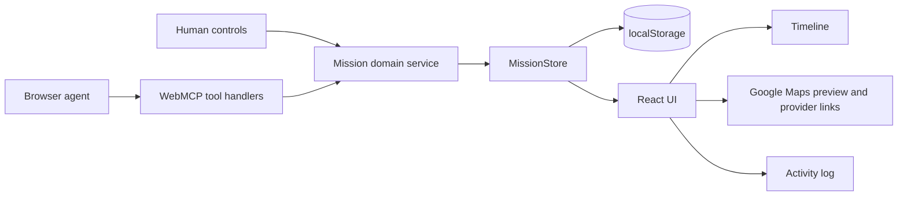

# Sidequest — technical execution plan

> Implementation plan for Codex  
> Research status: September 2, 2026  
> Deadline: **September 3, 2026, 22:00 CEST (GMT+2)**  
> Priority: one complete, repeatable demo flow

## 0. Execution directive

Build a static, local-first React + TypeScript application called Sidequest. It presents one day mission on a shared context + timeline + map + activity log screen. The UI and five imperative WebMCP tools must use the exact same store and domain functions. Do not add a backend, authentication, a custom chat, LLM calls, external search inside the app, a directions API, or multi-mission support.

Deliver this vertical slice first:

1. the user clicks `Done` on the gravel ride;
2. the agent calls `get_mission_state`;
3. the agent updates the context, skips the hike, and adds snorkeling and a fuel stop;
4. the agent reorders the remaining stops;
5. the timeline, map, and activity log immediately show the result;
6. the locked dinner remains at 18:30;
7. `Load demo` restores the identical fixture and `New plan` returns to a blank current-day board.

Record any ideas outside this slice in the README as future work, but do not implement them until the demo is stable.

## 1. Definition of Done

The project is complete when all of the following are true:

- the application builds with `npm run build` and no TypeScript warnings;
- the public deployment opens without authentication;
- the standard UI also works without `document.modelContext`;
- the top-level document registers exactly five tools through `document.modelContext.registerTool()`;
- the tools are discovered in ChatGPT's in-app browser and Chrome with WebMCP enabled;
- the core prompt takes the mission from revision 7 to the expected final state;
- every write validates its input at runtime and checks `expectedRevision`;
- a locked stop cannot be rescheduled or skipped;
- the UI and tools call the same domain operations;
- unit tests, tool contract tests, and the core E2E pass;
- the repository contains `README.md`, `LICENSE`, testing instructions, the live-app link, and tool documentation;
- the demo video is under three minutes.

## 2. Current WebMCP status and implementation consequences

### What is available as of September 2, 2026

- WebMCP is still a proposed/experimental web standard.
- The primary imperative interface is available at `document.modelContext`.
- A page registers tools with `registerTool({ name, description, inputSchema, execute, annotations })`.
- Tool registration follows the document lifecycle and can be removed with an `AbortSignal`.
- The specification describes `getTools()`, `executeTool()`, and the `toolchange` event for in-page agents.
- Chrome provides the local testing flag `chrome://flags/#enable-webmcp-testing`; its origin trial began with Chrome 149.
- Chrome recommends treating WebMCP as progressive enhancement.
- WebMCP requires an origin-isolated document; do not set `document.domain` or `Origin-Agent-Cluster: ?0`.

### Critical ChatGPT in-app browser limitations

OpenAI's official documentation currently states that ChatGPT's browser supports a subset of WebMCP:

- it supports tools registered imperatively through JavaScript;
- it does not expose declarative WebMCP forms as site tools;
- it does not discover tools registered in an iframe, even a same-origin iframe;
- tools must be registered in the top-level page;
- use GPT-5.6 Sol or GPT-5.6 Terra to test site tools; this feature is currently disabled for Luna;
- the feature is not currently available in Enterprise or Edu workspaces;
- the page should feature-detect the API and preserve the standard interface.

### Decisions resulting from these limitations

1. Use the **Imperative API** only.
2. Register the tools once in the top-level application code, never inside an iframe.
3. Keep `document.modelContext.registerTool()` explicitly visible in the repository; do not hide the entire integration behind a library.
4. Do not depend on experimental declarative form attributes.
5. Do not require the origin trial for the primary judging flow: the main instructions use ChatGPT's in-app browser, with flagged Chrome as a secondary environment.
6. When WebMCP is unavailable, show a neutral `Manual mode` badge instead of an application error.

## 3. Stack selection

### Recommended stack

| Layer | Choice | Why now |
|---|---|---|
| Runtime | Node.js 22 LTS | supported by current Vite and Playwright; stable for CI |
| Build | Vite 8 | very fast scaffolding and static `dist` output; no SSR or infrastructure |
| UI | React + TypeScript | fast state and component implementation; easy testing; familiar ecosystem |
| Styling | plain CSS + CSS custom properties | no configuration or design-system dependencies |
| Runtime schemas | Zod 4 | one source for types and validation; native `z.toJSONSchema()` for WebMCP |
| State | custom `MissionStore` + `useSyncExternalStore` | a small, framework-light source of truth also usable outside React |
| Persistence | localStorage | no backend, accounts, or secrets; sufficient for one demo mission |
| Reordering | Motion for React | controlled spring reordering with the whole unlocked row as the drag surface |
| Maps | Google Maps preview plus Google/Apple map links | recognizable map context, provider choice, and no fake straight-line routing |
| Unit/integration | Vitest + Testing Library | fast tests for domain functions, store, and components |
| E2E | Playwright with one Chromium project | tests the vertical slice with a mocked `document.modelContext` |
| Hosting | Netlify static site | simple `vite build` → `dist`, HTTPS, no functions or secrets |

### Why not Next.js

We do not need routing, SSR, API routes, server actions, or image optimization. Next.js would add decisions and debugging surface without benefiting the demo. Vite produces a static bundle that precisely fits a local-first application.

### Why no backend or OpenAI API

The browser agent provides intelligence, and WebMCP connects it to the page. A custom agent backend would duplicate the testing environment's role, require API keys, and distract from the WebMCP Leverage criterion. The app should be useful as a shared interface, not as another chat.

### Why no `usewebmcp`

Chrome documents an experimental React hook, but direct registration has three advantages in this project:

- the code required by the challenge is easy to find in the repository;
- we avoid churn in an experimental wrapper immediately before the deadline;
- registration outside the React tree avoids Strict Mode's double mount and accidental duplicates.

The `webmcp-types` package may provide ambient TypeScript declarations. If its types do not match the ChatGPT/Chrome runtime, add a minimal local `src/types/webmcp.d.ts` for the surface actually used instead of changing the runtime logic.

### Why Zod 4

Zod 4 can generate JSON Schema through `z.toJSONSchema()`. The same schema object can:

- infer the TypeScript type;
- validate raw input inside the handler;
- generate the `inputSchema` exposed to the agent.

This prevents drift between the tool description and actual validation. For compatibility, generate Draft 7 and avoid types without a JSON Schema representation, including `Date`, `bigint`, transforms, and `undefined` fields.

## 4. Minimal scaffold

```bash
npm create vite@latest sidequest -- --template react-ts
cd sidequest
npm install
npm install zod motion
npm install -D webmcp-types vitest jsdom \
  @testing-library/react @testing-library/jest-dom @playwright/test
npx playwright install chromium
```

After installation:

- commit `package-lock.json`;
- add `.nvmrc` containing `22`;
- inspect the versions that were actually installed instead of copying version numbers from this document into the lockfile;
- do not update dependencies after the recording setup is stable.

Scripts:

```json
{
  "scripts": {
    "dev": "vite",
    "build": "tsc -b && vite build",
    "preview": "vite preview",
    "test": "vitest run",
    "test:watch": "vitest",
    "test:e2e": "playwright test",
    "check": "npm run test && npm run build && npm run test:e2e"
  }
}
```

## 5. Architecture



The most important architectural rule:

> Neither a React component nor a WebMCP handler may modify the mission object directly. Both call the same `MissionService` methods, which validate rules, increment the revision, record an event, and publish a new snapshot.

### Layers

1. **Domain** — types, Zod schemas, pure operations, and invariants.
2. **Application/store** — state, subscriptions, persistence, fresh-plan creation, and fixture loading.
3. **WebMCP adapter** — tool definitions and input → domain command mapping.
4. **UI** — rendering and human actions.
5. **Infrastructure** — localStorage, Google/Apple map URLs, and source links.

## 6. Proposed repository tree

```text
sidequest/
├── public/
│   └── favicon.svg
├── src/
│   ├── app/
│   │   ├── App.tsx
│   │   └── app.css
│   ├── components/
│   │   ├── ContextCard.tsx
│   │   ├── MissionHeader.tsx
│   │   ├── MissionMap.tsx
│   │   ├── MissionTimeline.tsx
│   │   ├── StopCard.tsx
│   │   ├── ActivityLog.tsx
│   │   ├── SourceLink.tsx
│   │   └── WebMCPStatus.tsx
│   ├── domain/
│   │   ├── mission.schemas.ts
│   │   ├── mission.types.ts
│   │   ├── mission.commands.ts
│   │   ├── mission.service.ts
│   │   ├── mission.selectors.ts
│   │   └── mission.errors.ts
│   ├── store/
│   │   ├── mission.store.ts
│   │   ├── mission.persistence.ts
│   │   └── useMission.ts
│   ├── webmcp/
│   │   ├── registerMissionTools.ts
│   │   ├── toolDefinitions.ts
│   │   ├── toolResults.ts
│   │   └── agentSnapshot.ts
│   ├── demo/
│   │   ├── seedMission.ts
│   │   └── demoPrompt.ts
│   ├── types/
│   │   └── webmcp.d.ts          # only if the package types are insufficient
│   ├── main.tsx
│   └── index.css
├── tests/
│   ├── domain/
│   ├── webmcp/
│   └── e2e/
├── index.html
├── netlify.toml
├── playwright.config.ts
├── vite.config.ts
├── vitest.config.ts
├── README.md
├── LICENSE
└── package.json
```

Do not create routing or additional screens. A debug panel may be conditionally available at `?debug=1`, but it must not be required for the normal demo.

## 7. Data model

### Domain types

```ts
type StopStatus = "planned" | "active" | "completed" | "skipped";
type StopKind = "activity" | "service" | "meal" | "transition";
type EnergyLevel = "high" | "medium" | "low";
type Actor = "human" | "agent" | "system";

type GeoPoint = {
  label: string;
  lat: number;
  lng: number;
};

type SourceRef = {
  title: string;
  url: string;
  checkedAt: string; // ISO 8601 with offset
};

type MissionStop = {
  id: string;
  title: string;
  kind: StopKind;
  status: StopStatus;
  startsAt: string; // ISO 8601 with explicit offset
  durationMinutes: number;
  travelMinutesFromPrevious: number;
  location: GeoPoint;
  rationale: string;
  note?: string;
  source?: SourceRef;
  locked: boolean;
};

type DayContext = {
  currentTime: string;
  currentLocation: GeoPoint;
  energy: EnergyLevel;
  constraints: string[];
};

type MissionEvent = {
  id: string;
  at: string;
  actor: Actor;
  type:
    | "context_updated"
    | "stop_updated"
    | "stop_added"
    | "stops_reordered";
  summary: string;
};

type Mission = {
  schemaVersion: 1;
  id: string;
  revision: number;
  title: string;
  date: string; // YYYY-MM-DD
  timezone: string; // Europe/Zagreb
  context: DayContext;
  stops: MissionStop[];
  events: MissionEvent[];
};
```

### Domain rules

- `revision` increases by exactly 1 after every successful mutation.
- A failed mutation does not change state or localStorage.
- Every stop `id` is stable and unique within the mission.
- `startsAt`, `currentTime`, and `checkedAt` include the time-zone offset.
- `lat` ∈ `[-90, 90]`; `lng` ∈ `[-180, 180]`.
- `durationMinutes` ∈ `[5, 720]`.
- `travelMinutesFromPrevious` ∈ `[0, 240]`.
- All strings have length limits; HTML is never accepted.
- `source.url` must use HTTPS.
- `locked: true` prevents changes to `startsAt` and `status`, as well as deletion.
- `reorder_mission_stops` may change only `planned` or `active` stops.
- A reorder must contain every future stop ID exactly once, with no duplicates.
- A locked stop preserves its `startsAt`; in the demo, dinner must remain at `18:30+02:00`.
- Keep at most 8 stops, 6 constraints, and 20 events in memory.
- The UI renders strings as text nodes and never uses `dangerouslySetInnerHTML`.

### Source of truth

Zod schemas define both data and tool inputs. Derive types through `z.infer` and JSON Schema through:

```ts
const inputSchema = z.toJSONSchema(toolInputSchema, {
  target: "draft-07",
  io: "input",
});
```

If Chrome or ChatGPT rejects a schema containing the extra `$schema` field, remove only that key in the `toWebMCPSchema` helper. Do not manually duplicate complete schemas.

## 8. Store and application operations

### Public store contract

```ts
type MissionStore = {
  getSnapshot(): Mission;
  subscribe(listener: () => void): () => void;
  updateDayContext(input: UpdateDayContextInput, actor: Actor): ToolMutationResult;
  updateStop(input: UpdateMissionStopInput, actor: Actor): ToolMutationResult;
  addStop(input: AddMissionStopInput, actor: Actor): ToolMutationResult;
  reorderStops(input: ReorderMissionStopsInput, actor: Actor): ToolMutationResult;
  newPlan(): void;
  loadDemo(): void;
};
```

### Implementation

- Keep `currentMission` inside the store module.
- `getSnapshot()` must return the same object reference until the next mutation so that `useSyncExternalStore` works correctly.
- After a successful command: create a new immutable snapshot, increment the revision, append an event, write localStorage, and notify listeners.
- `newPlan()` replaces state with a blank current-day mission, while `loadDemo()` installs an exact deep clone of the seed—including `revision: 6` and an empty activity log. Both notify subscribers and remain scenario controls rather than mission mutations.
- Persistence key: `sidequest:mission:v1`.
- If localStorage contains an invalid or outdated payload, remove only that key and use a blank current-day mission; do not clear all localStorage.
- Every method first parses input with Zod, then checks the revision, then enforces invariants.

### Human actions

The human UI must not bypass the revision check. On click, it reads the current revision from the store and calls the same method:

```ts
store.updateStop(
  {
    expectedRevision: store.getSnapshot().revision,
    stopId,
    status: "completed",
    note: "Completed in the real world",
  },
  "human",
);
```

## 9. WebMCP tool strategy

### Rules

- Exactly five tools.
- Names use unambiguous verbs and stay under 30 characters.
- Each description explains what the tool does, when it is useful, and its side effect.
- Parameter descriptions stay under 150 characters.
- Tool descriptions stay under 500 characters.
- Every tool result stays under 1,500 characters.
- Every write uses the latest revision and returns the new revision.
- Tools return the minimum result needed for the next step, not the full state.
- Only `get_mission_state` returns source URLs and is marked as untrusted output.

### 9.1 `get_mission_state`

**Purpose:** read the concise state required for a decision and subsequent calls.

**Description:**

```text
Read the current Sidequest mission, including revision, time, location,
energy, constraints, stable stop IDs, statuses, planned times, locked
commitments, coordinates, and source links. Use before changing the mission.
```

**Input:** an empty strict object.

```json
{
  "type": "object",
  "properties": {},
  "additionalProperties": false
}
```

**Annotations:**

```json
{
  "readOnlyHint": true,
  "untrustedContentHint": true
}
```

`untrustedContentHint` is intentional because the snapshot may contain titles and links originating from external sources or user input.

**Example result:**

```json
{
  "ok": true,
  "revision": 7,
  "mission": {
    "id": "baska-voda-demo",
    "title": "Baška Voda Adventure",
    "timezone": "Europe/Zagreb",
    "context": {
      "currentTime": "2026-08-30T15:10:00+02:00",
      "currentLocation": { "label": "Bike parking, Baška Voda", "lat": 43.3569, "lng": 16.9502 },
      "energy": "low",
      "constraints": ["car available", "dog with us", "max 20 min drive", "keep dinner at 18:30"]
    },
    "stops": [
      { "id": "gravel-loop", "status": "completed", "startsAt": "2026-08-30T11:30:00+02:00", "locked": false },
      { "id": "biokovo-hike", "status": "planned", "startsAt": "2026-08-30T15:30:00+02:00", "locked": false },
      { "id": "return-shower", "status": "planned", "startsAt": "2026-08-30T17:15:00+02:00", "locked": false },
      { "id": "dinner", "status": "planned", "startsAt": "2026-08-30T18:30:00+02:00", "locked": true }
    ]
  }
}
```

Make the snapshot even more compact in code if it approaches 1,500 characters. Do not return the complete event log.

### 9.2 `update_day_context`

**Purpose:** replace the current context with one complete, coherent snapshot: time, location, energy, and constraints.

**Description:**

```text
Set the mission's current real-world context: time, location, energy, and active
constraints. This changes the shared board and returns its new revision.
```

**Input:**

```json
{
  "type": "object",
  "properties": {
    "expectedRevision": { "type": "integer", "minimum": 0 },
    "currentTime": { "type": "string", "format": "date-time" },
    "currentLocation": {
      "type": "object",
      "properties": {
        "label": { "type": "string", "minLength": 1, "maxLength": 80 },
        "lat": { "type": "number", "minimum": -90, "maximum": 90 },
        "lng": { "type": "number", "minimum": -180, "maximum": 180 }
      },
      "required": ["label", "lat", "lng"],
      "additionalProperties": false
    },
    "energy": { "type": "string", "enum": ["high", "medium", "low"] },
    "constraints": {
      "type": "array",
      "items": { "type": "string", "minLength": 1, "maxLength": 80 },
      "maxItems": 6,
      "uniqueItems": true
    },
    "reason": { "type": "string", "minLength": 1, "maxLength": 160 }
  },
  "required": ["expectedRevision", "currentTime", "currentLocation", "energy", "constraints", "reason"],
  "additionalProperties": false
}
```

**Demo call:**

```json
{
  "expectedRevision": 7,
  "currentTime": "2026-08-30T15:10:00+02:00",
  "currentLocation": { "label": "Bike parking, Baška Voda", "lat": 43.3569, "lng": 16.9502 },
  "energy": "low",
  "constraints": ["car available", "dog with us", "max 20 min drive", "keep dinner at 18:30"],
  "reason": "The group finished the ride and reported low energy."
}
```

### 9.3 `update_mission_stop`

**Purpose:** change the status and optional note of one existing, unlocked stop.

**Description:**

```text
Update one existing mission stop by stable ID by setting its status and optional
note. Use for planned, active, completed, or skipped state. Locked commitments
remain unchanged. This changes the board and returns its new revision.
```

**Input fields:**

- `expectedRevision: integer` — required;
- `stopId: string` — required;
- `status: planned | active | completed | skipped` — required;
- `note?: string, max 240`;
- `reason: string, max 160` — required.

**Demo call:**

```json
{
  "expectedRevision": 8,
  "stopId": "biokovo-hike",
  "status": "skipped",
  "note": "Skipped because the group is tired after the ride.",
  "reason": "A lower-effort activity now fits the group's energy better."
}
```

### 9.4 `add_mission_stop`

**Purpose:** add one new, source-backed stop researched by the agent.

**Description:**

```text
Add one researched stop to the current mission with a planned time, duration,
coordinates, travel estimate, rationale, and HTTPS source. This changes the
shared board and returns the new stop ID and revision.
```

**Input fields:**

- `expectedRevision: integer` — required;
- `title: string, 1..80` — required;
- `kind: activity | service | meal | transition` — required;
- `startsAt: ISO date-time with offset` — required;
- `durationMinutes: integer, 5..720` — required;
- `travelMinutesFromPrevious: integer, 0..240` — required;
- `location: { label, lat, lng }` — required;
- `rationale: string, 1..240` — required;
- `source: { title, https url, checkedAt }` — required;
- `note?: string, max 240`.

The application generates the ID from a readable slug and a short random suffix. The agent does not choose the ID.

**Demo call — snorkeling:**

```json
{
  "expectedRevision": 9,
  "title": "Punta Rata swim & snorkel",
  "kind": "activity",
  "startsAt": "2026-08-30T15:30:00+02:00",
  "durationMinutes": 70,
  "travelMinutesFromPrevious": 12,
  "location": { "label": "Punta Rata, Brela", "lat": 43.370062, "lng": 16.922775 },
  "rationale": "A lower-effort water stop with parking and pine shade, close enough to preserve dinner.",
  "source": {
    "title": "Punta Rata beach — TZ Brela",
    "url": "https://brela.hr/en/beaches/the-punta-rata-beach",
    "checkedAt": "2026-08-30T15:11:00+02:00"
  }
}
```

**Demo call — fuel:**

```json
{
  "expectedRevision": 10,
  "title": "Fuel at INA Makarska-Ratac",
  "kind": "service",
  "startsAt": "2026-08-30T17:05:00+02:00",
  "durationMinutes": 10,
  "travelMinutesFromPrevious": 22,
  "location": { "label": "Vukovarska 135, Makarska", "lat": 43.306819, "lng": 17.007086 },
  "rationale": "A published non-stop fuel station that can fit before the return and dinner.",
  "source": {
    "title": "Makarska-Ratac — INA",
    "url": "https://www.ina.hr/en/station/makarska-ratac/",
    "checkedAt": "2026-08-30T15:12:00+02:00"
  }
}
```

The fuel-station coordinates come from the `Show location on map` link on INA's official page. Still smoke-test the marker before recording. Do not describe the line on the map as an exact navigation route.

### 9.5 `reorder_mission_stops`

**Purpose:** atomically set the order and planned start times of every future stop.

**Description:**

```text
Set the order and planned start times of every active or planned mission stop.
Include each future stop exactly once. Locked commitments keep their original
time. This updates the shared timeline and map and returns the new revision.
```

**Input:**

```json
{
  "type": "object",
  "properties": {
    "expectedRevision": { "type": "integer", "minimum": 0 },
    "orderedStops": {
      "type": "array",
      "minItems": 1,
      "maxItems": 8,
      "items": {
        "type": "object",
        "properties": {
          "stopId": { "type": "string", "minLength": 1, "maxLength": 80 },
          "startsAt": { "type": "string", "format": "date-time" }
        },
        "required": ["stopId", "startsAt"],
        "additionalProperties": false
      }
    },
    "reason": { "type": "string", "minLength": 1, "maxLength": 160 }
  },
  "required": ["expectedRevision", "orderedStops", "reason"],
  "additionalProperties": false
}
```

**Demo call:**

```json
{
  "expectedRevision": 11,
  "orderedStops": [
    { "stopId": "punta-rata-abc1", "startsAt": "2026-08-30T15:30:00+02:00" },
    { "stopId": "ina-makarska-def2", "startsAt": "2026-08-30T17:05:00+02:00" },
    { "stopId": "return-shower", "startsAt": "2026-08-30T17:35:00+02:00" },
    { "stopId": "dinner", "startsAt": "2026-08-30T18:30:00+02:00" }
  ],
  "reason": "Fit snorkeling and fuel before the fixed dinner while keeping a short return buffer."
}
```

The agent must use the IDs returned by the two preceding `add_mission_stop` calls, not the example placeholders.

## 10. Result and error standard

### Successful mutation

```ts
type ToolMutationResult = {
  ok: true;
  revision: number;
  changed: {
    type: "context_updated" | "stop_updated" | "stop_added" | "stops_reordered";
    stopId?: string;
  };
  summary: string;
};
```

Example:

```json
{
  "ok": true,
  "revision": 10,
  "changed": { "type": "stop_added", "stopId": "punta-rata-k3m8" },
  "summary": "Added one planned activity to the shared mission."
}
```

### Controlled error

```ts
type ToolErrorResult = {
  ok: false;
  revision: number;
  error: {
    code: "INVALID_INPUT" | "STALE_REVISION" | "STOP_NOT_FOUND" | "LOCKED_STOP" | "INVALID_ORDER" | "LIMIT_REACHED";
    message: string;
    retryable: boolean;
  };
};
```

Stale-revision example:

```json
{
  "ok": false,
  "revision": 9,
  "error": {
    "code": "STALE_REVISION",
    "message": "Mission changed. Read the current mission and retry with revision 9.",
    "retryable": true
  }
}
```

Do not return stack traces, raw Zod issues, or the complete mission in a mutation result.

## 11. WebMCP registration

### Implementation pattern

The following code shows the required shape. Adapt the types to the version actually installed, but preserve the direct platform API call.

```ts
import * as z from "zod";
import type { MissionStore } from "../store/mission.store";

function toWebMCPSchema(schema: z.ZodType) {
  const json = z.toJSONSchema(schema, { target: "draft-07", io: "input" });
  const { $schema: _ignored, ...rest } = json;
  return rest;
}

export async function registerMissionTools(store: MissionStore) {
  const modelContext = document.modelContext;

  if (typeof modelContext?.registerTool !== "function") {
    return { supported: false, dispose() {} };
  }

  const controller = new AbortController();

  const register = async <T extends z.ZodType>(definition: {
    name: string;
    description: string;
    schema: T;
    annotations?: { readOnlyHint?: boolean; untrustedContentHint?: boolean };
    execute: (input: z.infer<T>) => unknown | Promise<unknown>;
  }) => {
    await modelContext.registerTool(
      {
        name: definition.name,
        description: definition.description,
        inputSchema: toWebMCPSchema(definition.schema),
        annotations: definition.annotations,
        execute: async (rawInput) => {
          const parsed = definition.schema.safeParse(rawInput);
          if (!parsed.success) {
            return invalidInputResult(store.getSnapshot().revision, parsed.error);
          }
          return definition.execute(parsed.data);
        },
      },
      { signal: controller.signal },
    );
  };

  await register({
    name: "get_mission_state",
    description: GET_MISSION_STATE_DESCRIPTION,
    schema: GetMissionStateInput,
    annotations: { readOnlyHint: true, untrustedContentHint: true },
    execute: () => toAgentSnapshot(store.getSnapshot()),
  });

  await register({
    name: "update_day_context",
    description: UPDATE_DAY_CONTEXT_DESCRIPTION,
    schema: UpdateDayContextInput,
    execute: (input) => store.updateDayContext(input, "agent"),
  });

  await register({
    name: "update_mission_stop",
    description: UPDATE_MISSION_STOP_DESCRIPTION,
    schema: UpdateMissionStopInput,
    execute: (input) => store.updateStop(input, "agent"),
  });

  await register({
    name: "add_mission_stop",
    description: ADD_MISSION_STOP_DESCRIPTION,
    schema: AddMissionStopInput,
    execute: (input) => store.addStop(input, "agent"),
  });

  await register({
    name: "reorder_mission_stops",
    description: REORDER_MISSION_STOPS_DESCRIPTION,
    schema: ReorderMissionStopsInput,
    execute: (input) => store.reorderStops(input, "agent"),
  });

  return {
    supported: true,
    dispose: () => controller.abort(),
  };
}
```

### Bootstrap in `main.tsx`

```ts
const store = createMissionStore(loadMissionOrSeed());

const registration = registerMissionTools(store)
  .then((result) => {
    webMCPStatusStore.set(result.supported ? "connected" : "unavailable");
    return result;
  })
  .catch((error) => {
    webMCPStatusStore.set("error");
    console.error("WebMCP registration failed", error);
    return null;
  });

if (import.meta.hot) {
  import.meta.hot.dispose(async () => (await registration)?.dispose());
}

createRoot(document.getElementById("root")!).render(
  <StrictMode>
    <App store={store} />
  </StrictMode>,
);
```

Do not register tools during component render. If registration partially fails, abort the controller and show `WebMCP setup error`; do not leave half the toolset registered.

## 12. Agent snapshot

`toAgentSnapshot()` must return only the data needed for the next decision:

- mission ID, title, revision, date, and time zone;
- current time/location/energy/constraints;
- for each stop: ID, title, kind, status, startsAt, duration, travel minutes, locked, and location;
- source only as `title` + `url`;
- no event log, styles, internal flags, or localStorage data.

Add a character-count assertion to the tests. If the JSON exceeds 1,500 characters:

1. omit `rationale` for completed and skipped stops;
2. shorten keys only in the snapshot layer, never in the domain;
3. never remove the revision, IDs, statuses, or locked flags.

## 13. Demo seed

The seed should be a TypeScript constant, not a separate request:

```ts
export const SEED_MISSION: Mission = {
  schemaVersion: 1,
  id: "baska-voda-demo",
  revision: 6,
  title: "Baška Voda Adventure",
  date: "2026-08-30",
  timezone: "Europe/Zagreb",
  context: {
    currentTime: "2026-08-30T15:10:00+02:00",
    currentLocation: {
      label: "Bike parking, Baška Voda",
      lat: 43.3569,
      lng: 16.9502,
    },
    energy: "medium",
    constraints: [
      "car available",
      "dog with us",
      "max 20 min drive",
      "keep dinner at 18:30",
    ],
  },
  stops: [
    // gravel-loop: active
    // biokovo-hike: planned
    // return-shower: planned
    // dinner: planned + locked
  ],
  events: [],
};
```

After the user clicks `Done`, the gravel ride becomes `completed` and the revision increases to 7. The seed already has a current time of 15:10, so this one user action creates exactly one `human` event. This is the state the agent reads.

Fresh-plan and demo actions should:

- start a first visit with a valid blank mission for the current day;
- ask for confirmation before replacing non-empty work;
- overwrite only `sidequest:mission:v1`;
- let `Load demo` restore the active gravel ride and revision 6;
- let `New plan` return to a blank board without removing unrelated browser data.

## 14. UI implementation contract

### Desktop layout

- a centered white canvas no wider than approximately 760 px;
- editable title, oversized date, sparse schedule, and generous negative space;
- exactly one of Plan, Context, Route, or History is visible at a time;
- secondary navigation stays behind one floating menu action;
- the primary result must be legible in a 1,440×900 recording.

### Mobile layout

- preserve the same title → date → current workspace hierarchy;
- position time/status left and item title right, matching the supplied calendar reference;
- every human action has a target of at least 44×44 px;
- no horizontal scrolling at 390 px.

### Visual behavior

- a `skipped` stop remains in history but not in the future route;
- a `completed` stop is visually subdued;
- a `locked` stop shows a frameless lock icon and fixed time;
- the whole unlocked row reorders with a controlled Motion spring and no drag handle;
- clicking an item title opens its inline actions; only its time/status changes to the accent color;
- no card border, selected bar, shadow, gradient, or decorative movement is permitted;
- clicking the Google Maps preview opens the selected location in Google Maps.

### WebMCP status

States:

- `checking` — a small neutral spinner;
- `connected` — a green dot and `Site tools connected`;
- `unavailable` — `Manual mode · open in ChatGPT or enable Chrome WebMCP`;
- `error` — `Site tools could not register` plus a link to the README instructions.

Never block the UI based on this status.

### ChatGPT prompt

On an empty plan, show a discreet `Copy prompt for ChatGPT` action. It copies the production URL and asks ChatGPT to open the page, gather the user's goal and constraints, and update the board through Site Tools. When the fixture is loaded, copy the exact demo prompt from the product document. Do not add a chat box.

## 15. Map and external data

### Google Maps preview

- derive preview and launch URLs from the selected future item in the pure presenter;
- use an iframe only as a visual preview; a full-preview overlay opens Google Maps in a new tab;
- use the official Google Maps Embed API endpoint when `VITE_GOOGLE_MAPS_EMBED_KEY` is configured;
- otherwise use Google's public embed URL without adding a map-rendering dependency;
- expose explicit Google Maps and Apple Maps links with secure external-link attributes;
- if the preview fails to load, keep the schedule and provider launch links usable.

### What the map does not do

- it does not calculate driving time;
- it does not draw or imply a straight-line route;
- it does not provide navigation;
- it does not send the device's current location;
- it does not retrieve hidden data from source URLs.

The agent supplies research and a travel estimate. The application stores the result and evidence but does not fetch source URLs, eliminating SSRF and CORS risk.

## 16. Security and trust boundaries

### Minimal threat model

| Threat | MVP mitigation |
|---|---|
| Invalid tool input | Zod parsing in every execute handler |
| Extra properties / hidden payloads | strict objects / `additionalProperties: false` |
| A stale write overwrites a human action | required `expectedRevision` |
| The agent changes a hard commitment | domain-level `locked` invariant |
| Malicious title or source title | length limits, text rendering, no HTML |
| Malicious URL | HTTPS only, `rel="noopener noreferrer"`, no fetching by the app |
| Prompt injection in source content | the app does not fetch content; snapshot annotated with `untrustedContentHint` |
| Excessive exposure | top-level same-origin only, no `exposedTo` |
| A tool returns too much data | explicit agent snapshot and 1,500-character budget test |
| Unclear side effects | precise descriptions and a visible activity log |

### Headers

At minimum:

```toml
[[headers]]
  for = "/*"
  [headers.values]
    Origin-Agent-Cluster = "?1"
    X-Content-Type-Options = "nosniff"
    Referrer-Policy = "strict-origin-when-cross-origin"
```

Do not set `Origin-Agent-Cluster: ?0`. You may add `Permissions-Policy: tools=(self)` after manually confirming that the platform and hosting behave correctly; the default WebMCP behavior for top-level/same-origin already matches the MVP requirement.

### Private data

The seed is a fictional demo mission. Do not use device GPS, contacts, browsing history, or account data. State in the README that localStorage remains inside the application's origin and the working plan can be cleared with `New plan`.

## 17. Testing strategy

### 17.1 Unit tests — P0

Test pure domain operations:

- updating context increments the revision and records the `agent` actor;
- human completion follows the same path and records the `human` actor;
- a stale revision does not change the object reference, persistence, or events;
- locked dinner rejects status and time changes;
- adding a stop validates latitude/longitude, HTTPS, lengths, and the eight-stop maximum;
- a generated ID is unique;
- a skipped stop is excluded from the future-route selector;
- reorder requires every future ID exactly once;
- reorder preserves the locked dinner time;
- loading the demo restores the seed and removes subsequent events;
- the event log is trimmed to 20 records.

### 17.2 WebMCP contract tests — P0

Use a fake `document.modelContext.registerTool` and capture the definitions:

- exactly five expected names are registered;
- no name exceeds 30 characters;
- no description exceeds 500 characters;
- parameter descriptions do not exceed 150 characters;
- every schema has `type: object` and `additionalProperties: false`;
- only the read tool has `readOnlyHint: true`;
- `get_mission_state` has `untrustedContentHint: true`;
- executing with invalid input does not change the store;
- executing a mutation calls the store with actor `agent`;
- disposal aborts registrations;
- a missing `document.modelContext` returns `supported: false` without throwing;
- every serialized scenario result stays under 1,500 characters.

### 17.3 React integration tests — P0

- the UI starts with a valid blank current-day plan;
- `Load demo` renders the deterministic seed;
- clicking `Done` updates status, revision, and activity log;
- invoking the store through an agent handler updates the existing DOM;
- the timeline and map selector have the same order;
- `unavailable` status does not disable human controls;
- source links contain secure attributes;
- `New plan` and `Load demo` switch between blank and deterministic states.

### 17.4 Playwright E2E — one core test

Before the page loads, inject a fake `document.modelContext` that stores registered tool definitions in `window.__registeredTools`. Then:

1. open `/`;
2. assert the blank first-use state, then choose `Load demo`;
3. assert the four fixture stops and click `Done` on the gravel ride;
4. in the page context, invoke the five tool handlers in sequence using the demo data;
5. after each mutation, use the revision returned by the previous call;
6. assert that the hike has `skipped` status;
7. assert Punta Rata and INA in the timeline;
8. assert their markers or accessible map labels;
9. assert exactly `18:30` on dinner;
10. assert `Agent` entries in the activity log;
11. reload and verify persistence;
12. choose `Load demo` again and verify the seed.

Do not try to prove the real WebMCP implementation through headless Playwright. This test proves the adapter and UI contract. Confirm the real browser integration manually.

### 17.5 Manual WebMCP matrix — P0

| Environment | Expected result |
|---|---|
| ChatGPT desktop built-in browser + Sol | 5 site tools discovered; prompt completes the flow |
| ChatGPT desktop built-in browser + Terra | 5 site tools discovered; prompt completes the flow |
| Chrome 149+ with the flag | inspector/getTools sees 5 tools |
| Chrome without the flag | application works in Manual mode |
| Safari/Firefox | application works in Manual mode |

If there is time for only two environments, prioritize ChatGPT and flagged Chrome.

### 17.6 Tool-selection evals

Run at least ten attempts or paraphrases of the core prompt. Evaluate:

- whether the agent starts with `get_mission_state`;
- whether it avoids trying to skip the locked dinner;
- whether it uses `update_mission_stop` rather than removing the hike;
- whether every new stop has a source URL;
- whether writes are sequential and use the latest revision;
- whether it finishes with `reorder_mission_stops`;
- whether the final UI has the expected order.

Minimum pass: 8 out of 10 complete successes. If tool selection is weak, improve names, descriptions, and schemas first; do not add model-specific instructions to the product.

Example paraphrases:

1. “We're done riding and wiped out. Drop the hike, add nearby snorkeling and fuel, keep dinner.”
2. “The gravel is complete. Make the rest of today lower effort without moving our 18:30 reservation.”
3. “Replace the hike with water time within a 20-minute drive and put a gas stop into the plan.”
4. “It's 15:10 at the car. Replan the board around low energy and the fixed dinner.”
5. “Update Sidequest, not just this chat: skip hiking, find snorkeling, add fuel, preserve dinner.”

## 18. Deployment

### Netlify configuration

```toml
[build]
  command = "npm run build"
  publish = "dist"

[[headers]]
  for = "/*"
  [headers.values]
    Origin-Agent-Cluster = "?1"
    X-Content-Type-Options = "nosniff"
    Referrer-Policy = "strict-origin-when-cross-origin"
```

No SPA redirect is needed when `/` is the only route. If you add `/debug`, implement it as a query string rather than introducing a router.

### Deployment checklist

- run `npm ci` from a clean checkout;
- run `npm run check`;
- run `npm run build` and a local `npm run preview`;
- connect the public repository to Netlify;
- set the build command to `npm run build`;
- set the publish directory to `dist`;
- verify HTTPS and headers;
- open the live URL without cache or in a private window;
- complete the entire manual WebMCP flow against the live URL;
- verify `New plan` and `Load demo`;
- verify source links and attribution;
- only then record the video.

### Origin trial

Do not block the submission on an origin-trial token. The challenge officially allows testing in ChatGPT's in-app browser or Chrome with the flag enabled. If a token is already available and easy to add, it may be embedded according to the current Chrome instructions, but rerun the complete smoke test afterward.

## 19. Phased implementation plan

### Phase 1 — scaffold and domain core, 60–90 minutes

- [ ] Create the Vite React TS project.
- [ ] Add dependencies and a lockfile.
- [ ] Define Zod schemas and inferred types.
- [ ] Implement the seed.
- [ ] Implement pure commands and invariants.
- [ ] Add unit tests for revision, locked stop, and reorder.

Exit criterion: domain tests pass and the complete scenario can run in code without the UI.

### Phase 2 — store and persistence, 45–60 minutes

- [ ] Implement the external store.
- [ ] Add the localStorage adapter.
- [ ] Add actor-aware events.
- [ ] Add blank-plan creation and explicit demo loading.
- [ ] Add `useMission` based on `useSyncExternalStore`.

Exit criterion: human and agent commands update one store; reload preserves state.

### Phase 3 — vertical UI, 2–3 hours

- [ ] Header and WebMCP status.
- [ ] Context card.
- [ ] Timeline and StopCard.
- [ ] Human Done/Skip/Undo.
- [ ] Activity log.
- [ ] Google Maps preview, provider launch links, and selection sync.
- [ ] Responsive layout.
- [ ] Copy the fresh-plan or demo prompt appropriate to the current state.

Exit criterion: the before/after flow can be reproduced manually and the screen looks good at 1,440×900.

### Phase 4 — five WebMCP tools, 90–120 minutes

- [ ] Build the agent snapshot.
- [ ] Add descriptions and generated JSON Schemas.
- [ ] Add direct `registerTool` bootstrap.
- [ ] Add feature detection and statuses.
- [ ] Add controlled error results.
- [ ] Add AbortController cleanup.
- [ ] Add contract tests.

Exit criterion: a fake modelContext invokes every handler and the UI updates.

### Phase 5 — integration and real-browser test, 90 minutes

- [ ] Build one Playwright E2E.
- [ ] Run the full `npm run check`.
- [ ] Test ChatGPT's in-app browser with Sol/Terra.
- [ ] Test Chrome with the flag.
- [ ] Record failures and fix only contracts that affect the killer flow.

Exit criterion: a real agent completes the scenario at least three times in a row.

### Phase 6 — deployment and submission assets, 2–3 hours

- [ ] Public repository + LICENSE.
- [ ] Netlify deployment.
- [ ] README with testing instructions.
- [ ] Before/after screenshot.
- [ ] Record the 2:20–2:40 video.
- [ ] Populate Devpost with the copy from the product document.
- [ ] Verify the live URL from a new session.
- [ ] Submit no later than 20:00 CEST, preserving a two-hour buffer.

Exit criterion: the submission is saved, every URL is public, and the video plays with audio.

## 20. Critical schedule to the deadline

Assuming work starts on September 2:

| Time | Outcome |
|---|---|
| Sep 2, +2 h | domain + store + seed |
| Sep 2, +5 h | usable single screen without WebMCP |
| Sep 2, +7 h | five tools work through a fake modelContext |
| Sep 2, +9 h | first real ChatGPT/Chrome test |
| Sep 3, morning | bug fixes, responsive pass, deployment |
| Sep 3, 13:00 CEST | feature freeze |
| Sep 3, 14:00–17:00 | recording, screenshots, README |
| Sep 3, 18:00–20:00 | final QA and submission |
| Sep 3, 22:00 | official hard deadline—do not plan work up to this time |

### Stop-the-line rules

- If the map blocks WebMCP, replace the tiles with a simple grid and markers; keep the timeline.
- If automatic research is unstable, use the verified fallback prompt.
- If `reorder` is unstable, improve its schema or description; do not add a sixth “magic” tool.
- If an animation causes a bug, remove the animation.
- If mobile polish is incomplete, ensure only a correct vertical stack and no overflow; the desktop demo takes priority.
- Do not add dependencies after feature freeze.

## 21. README contract

The README should contain these sections in this order:

1. hero screenshot;
2. one-liner and differentiation from a trip planner;
3. live-app link;
4. 60-second “How it works”;
5. exact demo prompt;
6. list of the five WebMCP tools;
7. ChatGPT in-app browser instructions;
8. Chrome flag instructions;
9. manual fallback;
10. local `npm ci`, `npm run dev`, and `npm run check` commands;
11. shared-store architecture;
12. security decisions;
13. known limitations;
14. video link;
15. license.

Do not require a judge to build the repository. The README must make the complete product understandable even without opening the live URL.

## 22. Codex checklist

### Before coding

- [ ] Read this entire document and `01-sidequest-product-en.md`.
- [ ] Inspect the existing repository, package manager, AGENTS.md files, and dirty files.
- [ ] Do not delete user changes.
- [ ] Reconfirm the current `document.modelContext` in official documentation if the implementation differs from the example.
- [ ] Plan one vertical slice, not separate prototypes.

### Domain

- [ ] Zod is the source of types and JSON Schema.
- [ ] All objects are strict.
- [ ] A revision check precedes every mutation.
- [ ] Locked invariants live in the domain service.
- [ ] Source URLs use HTTPS.
- [ ] Strings contain no HTML.
- [ ] The event log records an actor.

### WebMCP

- [ ] A direct `document.modelContext.registerTool` call is visible in source.
- [ ] Registration occurs once at the top level.
- [ ] Feature detection is present.
- [ ] AbortController cleanup is present.
- [ ] There are exactly five tools.
- [ ] Tool names, descriptions, and parameters stay within their budgets.
- [ ] `get_mission_state` has both required annotations.
- [ ] Write handlers use actor `agent`.
- [ ] Tool results are concise and serializable.
- [ ] There are no declarative forms or iframe tools.
- [ ] There is no `exposedTo` for foreign origins.

### UI

- [ ] Human and agent actions use the same store.
- [ ] Changes are immediately visible.
- [ ] Dinner at 18:30 is visibly locked.
- [ ] A skipped stop disappears from the active route but remains in history.
- [ ] Source links are visible and secure.
- [ ] Unavailable WebMCP does not block the UI.
- [ ] Demo loading is deterministic.
- [ ] The screen is suitable for a 1,440×900 recording.

### Tests

- [ ] Unit: revision, locked, add, reorder, new plan, and demo loading.
- [ ] Contract: exactly five definitions and all budgets.
- [ ] Integration: a tool handler updates the React DOM.
- [ ] E2E: the complete killer flow.
- [ ] Manual: ChatGPT + Chrome flag.
- [ ] Evals: at least ten paraphrases, target 8/10.

### Delivery

- [ ] Build from a clean checkout.
- [ ] Public HTTPS deployment.
- [ ] Public repository.
- [ ] Visible open-source license.
- [ ] README and testing instructions.
- [ ] Video under three minutes with audio.
- [ ] Submission ready before 20:00 CEST.

## 23. Ready-to-use Codex starting prompt

```text
Implement Sidequest from the two project documents in this repository:
01-sidequest-product-en.md and 02-sidequest-technical-execution-en.md.

Start by inspecting the repository, package manager, AGENTS.md files, and current
changes. Preserve all user work. Build only the P0 vertical slice first: the
Baška Voda demo mission, shared MissionStore, human Done/Skip actions, timeline,
Motion-reorderable lists, Google Maps preview, actor-aware activity log, deterministic demo loading, and exactly five
imperative WebMCP tools registered in the top-level page through
document.modelContext.registerTool().

Use React, TypeScript, Vite, Zod, localStorage, Motion, Vitest, Testing Library,
and one Chromium Playwright E2E as specified. UI actions and WebMCP handlers must
call the same validated domain service. Every write must require an optimistic
expectedRevision. Locked dinner at 18:30 must be enforced in domain code.
Feature-detect WebMCP and keep the manual UI fully usable without it.

Do not add a backend, authentication, a chat UI, an LLM API, live geolocation,
weather, directions, multi-mission routing, declarative WebMCP, or iframe tools.
Do not deploy or publish without explicit authorization.

Work in small verified increments. After the P0 flow works, run unit, contract,
integration, E2E, typecheck, and production build checks. Then report: files
changed, the complete test results, how to run the real WebMCP manual test, and
any remaining setup needed for deployment or recording.
```

## 24. Technical sources

- [OpenAI Docs: Site tools](https://learn.chatgpt.com/docs/webmcp) — current ChatGPT implementation, top-level imperative requirement, unsupported declarative/iframe features, and recommended testing approach.
- [Chrome: WebMCP overview](https://developer.chrome.com/docs/ai/webmcp) — status, origin isolation, permissions, origin trial, and local flag.
- [Chrome: Imperative API](https://developer.chrome.com/docs/ai/webmcp/imperative-api) — `registerTool`, `AbortSignal`, `getTools`, `executeTool`, and lifecycle.
- [Chrome: WebMCP best practices](https://developer.chrome.com/docs/ai/webmcp/best-practices) — tool strategy, runtime validation, and eval testing.
- [Chrome: WebMCP tool security](https://developer.chrome.com/docs/ai/webmcp/secure-tools) — `readOnlyHint`, `untrustedContentHint`, and recommended character budgets.
- [WebMCP Draft Community Group Report](https://webmachinelearning.github.io/webmcp/) — current WebIDL and platform behavior.
- [Zod: JSON Schema](https://zod.dev/json-schema) — `z.toJSONSchema()` and conversion constraints.
- [Vite: Getting Started](https://vite.dev/guide/) — current Node requirements and React TS scaffolding.
- [Vite: Static Deploy](https://vite.dev/guide/static-deploy) — production static build.
- [Motion React reorder](https://motion.dev/docs/react-reorder) — controlled `Reorder.Group` and `Reorder.Item` interaction.
- [Google Maps URLs](https://developers.google.com/maps/documentation/urls/get-started) — cross-platform map launch URLs.
- [Google Maps Embed API](https://developers.google.com/maps/documentation/embed/quickstart) — keyed preview endpoint.
- [Apple Map Links](https://developer.apple.com/library/archive/featuredarticles/iPhoneURLScheme_Reference/MapLinks/MapLinks.html) — Apple Maps launch parameters.
- [Playwright](https://playwright.dev/docs/intro) — Chromium E2E and isolated browser contexts.
- [Netlify framework build settings](https://docs.netlify.com/build/frameworks/overview/) — Vite build and `dist` directory.
- [The WebMCP Challenge rules](https://webmcp.devpost.com/rules) — repository, working-project, and judging requirements.
- [Challenge resources and FAQ](https://webmcp.devpost.com/resources) — testing environments, public deployment, and video requirements.

> WebMCP is under active development. If runtime behavior differs from this document, first check the current OpenAI and Chrome documentation, then update the thin WebMCP adapter. Do not change the domain model or UI as a workaround.
